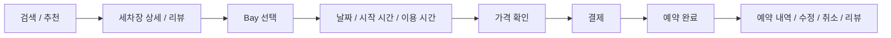
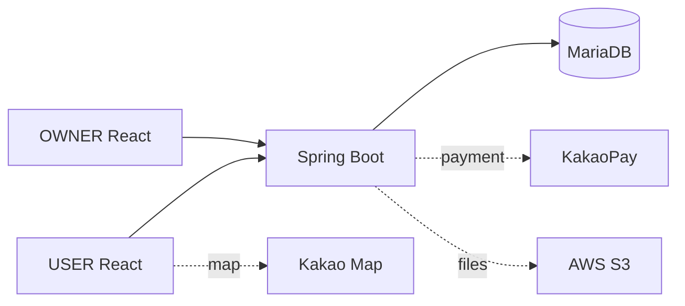
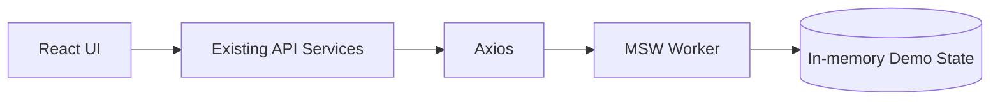
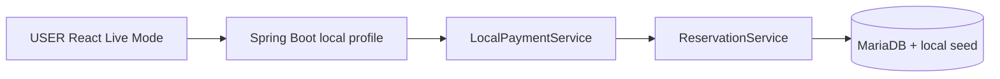

# 뽀득뽀득

> 셀프세차장을 검색하고 Bay와 이용 시간을 선택해 예약·결제하는 서비스입니다.<br>
> **Portfolio Main · USER Frontend** — 2023 Kakao Tech Campus 팀 프로젝트의 React USER를 기반으로, 2026년에 예약·결제 안정성, 회귀 테스트, Stateful MSW Demo, Local Full-stack 재현을 개인 작업으로 보강했습니다.

**핵심 기여:** 예약 흐름을 중심으로 USER Frontend 핵심 구현에 참여<br>
**Portfolio Demo:** 배포 준비 중

| Frontend Tests | Reservation Rule Tests | Main Bundle | Local Full-stack E2E |
|---:|---:|---:|---:|
| 61 passed | 24 | 528.08 → 302.36 KB (-42.74%) | verified |

<!-- TODO: 2026 Portfolio Demo hero — Home / Detail / Reservation Result -->

## Project at a Glance

| 구분 | 내용 |
|---|---|
| 서비스 | 검색·예약·결제·예약 관리·리뷰를 제공하는 셀프세차장 예약 서비스 |
| 2023 Original Team Project | 2023.09.25–2023.11.11 · Kakao Tech Campus · Frontend 3명 / Backend 3명 |
| 2026 Portfolio Refactoring | USER Frontend 안정성·테스트·Demo/Live build·로딩 성능 개선 |
| 2026 Local Full-stack Reproduction | 기존 Backend fork를 복구해 React → Spring Boot → MariaDB 흐름 검증 |
| 이 저장소의 역할 | 세 저장소 중 포트폴리오 대표 entry point이자 Core Contribution |

## Portfolio Demo

배포 URL은 준비 중입니다. Demo build는 실제 Backend나 외부 결제 없이도 로그인부터 예약 생성, 취소, 리뷰까지 연결해 확인할 수 있습니다. 화면만 고정한 mock이 아니라 작업 결과가 다음 화면에 반영되는 in-memory state를 사용합니다.

```bash
npm ci
npm run build:demo
npm run preview -- --outDir dist-demo
```

개발 서버는 별도 `dev:demo` script가 없으므로 `npm run dev -- --mode demo`로 실행합니다. Demo 계정은 화면에 제공되며, 새로고침하면 seed 상태로 돌아갑니다.

<!-- TODO: 2026 Portfolio Demo — Search → Detail / Reservation Time / Payment / History -->

## Core User Flow



## My Contribution

### 2023 Original Project

팀 전체 산출물과 개인 기여를 구분했습니다. Git history를 기준으로 **예약 흐름을 중심으로 USER Frontend 핵심 구현에 참여**했습니다.

- DatePicker, TimePicker, DurationPicker와 Schedule 예약 선택 UI
- Bay 선택·예약 현황, 예약 Redux state
- Payment / PaymentWaiting / PaymentResult UI
- 예약 내역·취소, 세차장 상세, 별점·키워드·리뷰 UI
- 로그인·회원가입 오류 처리 일부, Kakao Map 표시 일부, 공통 component·error UI 일부

USER 전체 또는 서비스 전체 Frontend를 단독 구현한 작업은 아닙니다. OWNER에서는 세차장 등록 화면 초기 UI, 초기 TimeSelector와 24시간 옵션, 초기 FileUploader, 일부 atom/form component에 참여했으며 보조 저장소로만 연결합니다. 2023 Backend는 본인 구현이 아닙니다.

### 2026 Portfolio Refactoring

USER Frontend를 개인적으로 개선했습니다. 예약 시간 계산을 pure function으로 분리하고 결제 lifecycle과 Redux reset 시점을 정리했으며, loading/error/empty state, null 방어, mutation 중복 방지, React Query cache, keyboard interaction을 보강했습니다. 전체 페이지에 route-level lazy loading을 적용하고, 기존 API service를 유지한 Stateful MSW Demo와 Demo/Live build 경계를 구축했습니다. Backend 회원가입 password 계약과의 정합성도 맞췄습니다.

## Key Engineering Challenges

### 1. Reservation Time Reliability

| 단계 | 내용 |
|---|---|
| Problem | 09:30 같은 minute 단위 영업시간, 오늘의 지난 시간, 기존 예약과 날짜 변경이 하나의 UI state에 얽혀 잘못된 slot이나 stale 선택이 남을 수 있었습니다. |
| Cause | 시간 계산과 picker 표시·Redux 변경이 결합되어 경계값과 cross-day datetime을 일관되게 검증하기 어려웠습니다. |
| Improvement | 영업 범위·현재 시각·예약 overlap을 pure function으로 분리했습니다. 기존 예약 종료와 새 예약 시작이 같은 시각인 경우는 허용하고, 날짜 변경 시 시작 시간, 시작 시간 변경 시 duration을 reset했습니다. 날짜와 시간을 결합해 cross-day 비교가 가능하도록 했습니다. |
| Verification | 09:30 경계, 과거 시간, overlap/인접 예약, 날짜 변경, cross-day를 포함한 예약 규칙 regression test 24개를 통과했습니다. |

세부 규칙과 test matrix는 [Refactoring Notes](docs/refactoring.md#reservation-business-rules)에 정리했습니다.

### 2. Payment Lifecycle

| 단계 | 내용 |
|---|---|
| Problem | stale `tid`, callback 직접 접근·새로고침, 잘못된 callback state, 실패 후 retry가 중복 approve나 잘못된 완료 화면으로 이어질 수 있었습니다. |
| Cause | 브라우저 이동 전후의 payment state와 approve mutation, 예약 완료 후 Redux reset 책임이 분산돼 있었습니다. |
| Improvement | callback token/state를 검증하고 잘못된 접근에서는 stale `tid`를 제거했습니다. approve 진행 중 재요청을 막고 실패 후 재시도 경로를 분리했으며, 예약 완료가 확인된 뒤에만 예약 Redux state를 reset하도록 정리했습니다. |
| Verification | callback 누락, direct access, 중복 요청 방지, 완료 결과 fallback과 store reset을 Frontend regression tests로 검증했습니다. |

이는 비동기 lifecycle 안정화 사례이며, 2026년에 production KakaoPay E2E를 재검증했다는 의미가 아닙니다.

### 3. Stateful MSW Portfolio Demo

| 단계 | 내용 |
|---|---|
| Problem | 종료된 팀 Backend와 KakaoPay 없이 채용 검토자가 핵심 흐름을 재현하기 어려웠습니다. |
| Cause | 단일 응답 mock만으로는 결제 후 예약 생성, 취소와 리뷰처럼 앞선 행동이 다음 조회를 바꾸는 lifecycle을 설명할 수 없습니다. |
| Improvement | `React → Existing API Services → Axios → MSW → In-memory Demo State` 구조로 로그인, 조회, Bay/시간/가격, fake payment ready/callback/approve, 예약 생성·내역·취소·리뷰를 연결했습니다. 기존 API service는 변경하지 않았고 Live에서는 worker를 로드하지 않습니다. 미등록 `/api/*`는 501로 fail-closed 처리합니다. |
| Verification | 실제 API service를 호출하는 Demo flow test 8개와 mode boundary test 2개로 lifecycle 및 미등록 API 차단을 확인했습니다. 새로고침 시 state는 seed로 초기화됩니다. |

### 4. Performance & Runtime Stability

| 측정 | Before | After | 감소 |
|---|---:|---:|---:|
| Main JavaScript | 528.08 KB | 302.36 KB | 42.74% |
| gzip | 177.45 KB | 98.69 KB | 44.38% |

모든 page import를 `React.lazy`로 전환하고 공통 `Suspense` loading fallback을 적용해 초기 main bundle을 줄였습니다. 동시에 API loading/error/empty state, undefined/null 방어, mutation 중복 요청 방지, query key·invalidate 기반 cache 안정성, 일부 keyboard interaction을 보강했습니다.

### 5. Local Full-stack Reproduction

| 단계 | 내용 |
|---|---|
| Problem | 종료된 2023 Backend 환경 때문에 실제 DB insert까지 이어지는 USER Live Mode를 확인할 수 없었습니다. |
| Cause | Java/Gradle 실행 환경, MariaDB schema·seed, JWT/CORS와 외부 KakaoPay 의존성을 로컬에 맞춰 복구해야 했습니다. |
| Improvement | 기존 팀 Backend fork에 `local` Spring profile, local seed와 `LocalPaymentService`를 두고 최소 correctness bug 및 cross-day reservation datetime을 수정했습니다. production KakaoPay service와 local fake payment는 profile로 분리했습니다. |
| Verification | 로그인 → JWT → 세차장/Bay/시간/가격 → payment ready/callback/approve → MariaDB reservation insert → 예약 내역 반영을 E2E smoke로 확인했습니다. 핵심 Backend regression tests 19개도 별도로 통과했습니다. |

Backend를 새로 개발한 작업이 아니라, 기존 fork의 local reproduction과 USER integration 검증입니다. 실행 범위는 [Local Full-stack Reproduction](docs/local-reproduction.md)을 참고하세요.

## Architecture

### Original / Live Architecture



### Portfolio Demo Architecture



### Local Reproduction Architecture



인증·결제 흐름과 저장소 책임은 [Architecture Notes](docs/architecture.md)에 분리했습니다.

## Testing & Metrics

| 범위 | 결과 | 근거 |
|---|---:|---|
| Frontend | 16 files / 61 passed | `npm test` |
| Reservation time | 24 passed | pure function boundary regression |
| Stateful Demo | 8 flow + 2 mode tests | API service 기반 lifecycle / Live boundary |
| Live build | success | `npm run build` |
| Demo build | success | `npm run build:demo` |
| Backend core regression | 19 passed | Local Payment 10 + Datetime 5 + Live Integration 4 |

Backend 수치는 local reproduction에 추가한 핵심 test만 뜻합니다. legacy 전체 test suite 성공을 주장하지 않습니다.

## Tech Stack

| 2023 Original | 2026 Portfolio Work |
|---|---|
| React 18, JavaScript | Vitest, React Testing Library |
| Redux / Redux Toolkit / Redux Persist | Stateful MSW Demo |
| TanStack React Query, React Router | Route-level Lazy Loading / Suspense |
| Axios, Day.js, React Hook Form | Demo / Live Build Separation |
| Tailwind CSS, Vite, Storybook | Frontend regression test suite |
| MSW, Vite PWA Plugin | Local Full-stack integration verification |

## Demo / Live Boundary

| | Portfolio Demo | Live |
|---|---|---|
| Backend | MSW | Spring Boot |
| Payment | in-app fake flow | KakaoPay |
| State | in-memory; refresh 시 seed reset | Backend DB |
| API service | 기존 service | 기존 service |
| External payment | 없음 | 있음 |
| MSW worker | 로드됨 | 로드되지 않음 |
| Purpose | 포트폴리오 핵심 흐름 재현 | original service / local integration |

## Repositories

| 저장소 | 포트폴리오 역할 | 기여 범위 |
|---|---|---|
| **[USER Frontend](https://github.com/minjuko/Team10_FE_USER)** | **Portfolio Main / Core Contribution** | 예약 흐름 중심의 2023 핵심 구현 + 2026 개인 리팩토링 |
| [OWNER Frontend](https://github.com/minjuko/Team10_FE_OWNER) | Supporting Admin Service | 초기 등록 UI와 일부 component의 Partial Contribution |
| [Backend](https://github.com/minjuko/Team10_BE) | Original Team Backend Fork | 2023 본인 구현 아님; 2026 Local Reproduction / Integration Support |

## Getting Started

### Portfolio Demo

```bash
npm ci
npm run dev -- --mode demo
```

```bash
npm run build:demo
npm run preview -- --outDir dist-demo
```

### Live Frontend

`.env.example`을 복사하고 실제 환경에 맞는 공개 설정값을 입력합니다. secret은 저장소에 커밋하지 않습니다.

```dotenv
VITE_API_BASE_URL=http://localhost:8080
VITE_KAKAOMAP_API_KEY=your_kakao_javascript_key
VITE_DEMO_MODE=false
```

```bash
npm ci
npm run dev
npm run build
```

### Local Full-stack

Java 17, Gradle wrapper, MariaDB와 Backend `local` profile이 필요합니다. seed 적용, Backend 실행, USER 연결 순서는 [docs/local-reproduction.md](docs/local-reproduction.md)에 실제 fork 설정 기준으로 정리했습니다.

## Known Limitations

- 2026년 production KakaoPay E2E와 AWS/S3 local flow는 재검증하지 않았습니다.
- Demo state는 브라우저 새로고침 시 seed로 초기화됩니다.
- OWNER는 로그인·조회 중심 smoke 범위이며 전체 관리 lifecycle을 검증하지 않았습니다.
- Backend legacy tests에는 fixture isolation backlog가 있어, 위 19개 핵심 regression 결과와 구분합니다.
- production 환경의 동시 예약 경쟁 조건을 보장하지 않습니다.
- 22:00–02:00처럼 자정을 넘는 영업시간 모델은 현재 UI 규칙의 지원 범위 밖입니다. 다만 예약 datetime의 cross-day 계산 regression은 보완했습니다.
- 실제 Kakao Map 표시는 Kakao JavaScript Map API key가 필요합니다.

## Project History & Credits

- **2023.09.25–2023.11.11:** Kakao Tech Campus 1기 3단계, FE 3명 / BE 3명의 팀 프로젝트로 USER·OWNER·Backend 개발
- **2026:** USER Frontend 포트폴리오 리팩토링 및 기존 Backend fork의 local full-stack reproduction을 개인 작업으로 수행
- 2023 최종 상태는 Git tag `archive/2023-final`에 보존했습니다.
- [2023 Original README](docs/archive/README-2023-original.md)

### 2023 Original Project Screens

아래 이미지는 현재 Demo가 아닌 **2023 Original Project** 화면입니다.

<p align="center">
  
  
  
  
</p>

<!-- TODO: 2026 Portfolio Demo screenshot 1 — Hero: Home / Detail / Reservation Result -->
<!-- TODO: 2026 Portfolio Demo screenshot 2 — Search → Detail -->
<!-- TODO: 2026 Portfolio Demo screenshot 3 — Reservation Time -->
<!-- TODO: 2026 Portfolio Demo screenshot 4 — Demo Payment Flow -->
<!-- TODO: 2026 Portfolio Demo screenshot 5 — Reservation History lifecycle -->
<!-- TODO: 2026 Portfolio Demo video -->
