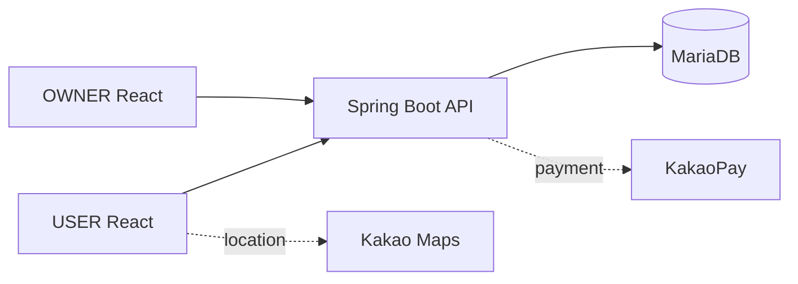

# 뽀득뽀득 — USER Frontend

> 셀프세차장 탐색부터 Bay 기반 예약·결제·리뷰까지 제공하는 모바일 웹 서비스

[](https://github.com/minjuko/ppodeuk-user-frontend/actions/workflows/ci.yml)


뽀득뽀득은 Frontend 3명·Backend 3명이 개발한 팀 프로젝트입니다.  
저는 **USER Frontend의 예약 Flow**를 중심으로 구현했고, 이후 예약·결제 안정성, 회귀 테스트, 실행 환경을 개선했습니다.

<p align="center">
  
</p>
<p align="center"><sub>Bay 선택 · 예약 시간 선택 · 결제 · 예약 완료</sub></p>

## Project Overview

| 항목 | 내용 |
|---|---|
| 기간 | 2023.09.14–2023.12.02 |
| 형태 | 카카오 테크 캠퍼스 1기 · 6인 팀 프로젝트 |
| 개인 역할 | USER Frontend 예약 Flow · 세차장 상세·리뷰·지도 UI 일부 |
| Frontend | React 18 · JavaScript · Redux Toolkit · TanStack Query · Vite |
| Backend | Spring Boot · MariaDB |
| 성과 | 카카오 테크 캠퍼스 1기 신규 서비스 개발 프로젝트 대상 |

## Live Deployment

| Service | URL |
|---|---|
| USER Frontend | [ppodeuk-user.vercel.app](https://ppodeuk-user.vercel.app/) |
| OWNER Frontend | [ppodeuk-owner.vercel.app](https://ppodeuk-owner.vercel.app/) |
| Backend API | [team10be-production.up.railway.app](https://team10be-production.up.railway.app/) |

USER·OWNER Frontend와 Spring Boot API·MariaDB를 연결했고, USER 예약 Flow의 **KakaoPay 테스트 결제**까지 확인했습니다. 테스트 결제는 실제 청구를 위한 운영 결제가 아닙니다. 공용 데모에서는 실제 개인정보나 결제정보를 입력하지 마세요.

## My Contribution

### USER Frontend

- Bay → 날짜 → 시작 시간 → 이용 시간을 순서대로 선택하는 예약 UI와 공유 예약 상태를 구현했습니다.
- 영업시간과 기존 예약을 반영해 선택 가능한 시간 조합만 보여주도록 예약 조건을 연결했습니다.
- 세차장 상세·리뷰·Kakao Map UI 일부와 결제 UI·예약 상태 연결에 참여했습니다.
- 개선 작업에서 예약 시간 계산을 Pure Function으로 분리하고, 결제 callback·Loading/Error/Empty State·cache invalidation·keyboard interaction을 보완했습니다.

### 팀 기능과 개인 기여의 경계

- OWNER의 Dashboard·매출·Bay·예약 관리와 Backend 원 구현은 개인 담당 범위가 아닙니다.
- OWNER에서는 세차장 등록 화면의 초기 구조와 일부 입력·공통 UI에 참여했습니다.
- Backend는 원 개발 담당이 아니며, 이후 local 실행 환경과 USER Frontend 연동 검증을 보완했습니다.

## Key Engineering Decisions

### 예약 조건의 종속 상태를 명확히 관리

상위 조건이 바뀌면 하위 선택값을 초기화해 이전 선택이 다음 요청에 남지 않게 했습니다.

```text
Bay → 날짜 → 시작 시간 → 이용 시간 → 예약·결제
  변경 시 종속 선택값 초기화
```

시간 규칙은 UI에서 분리해 영업시간, 30분 단위 slot, 이용 시간, 기존 예약의 겹침과 자정 경계를 회귀 테스트로 고정했습니다.

### 결제 Lifecycle 안정화

결제 준비부터 callback·승인·예약 완료까지의 상태를 분리했습니다. callback 직접 접근, 누락 token, 진행 중 중복 요청과 실패 후 retry를 방어하고, 완료 확인 뒤 예약 상태와 Query Cache를 동기화했습니다.

### API Contract 기반 병렬 개발

Frontend는 API 명세에 맞춰 화면·요청 구조를 구현하고, Backend 준비 전에는 MSW로 예약 흐름을 검증했습니다. 실제 API 연동 후에도 서비스 계층과 Axios 경계를 유지했습니다.



## Quality Verification

| 검증 | 결과 |
|---|---:|
| Frontend tests | **74 / 74 passed** |
| Test files | **18 / 18 passed** |
| 예약 규칙 회귀 테스트 | **24 / 24 passed** |
| Production build | **728 modules transformed** |
| Main JavaScript | **343.12 kB · gzip 113.08 kB** |
| GitHub Actions | `npm ci` · lint · test · build 성공 |

## Local Run

```bash
npm ci
npm run dev
```

테스트와 Production build는 다음 명령으로 확인합니다.

```bash
npm run lint
npm test -- --run
npm run build
```

Stateful MSW 기반 Demo는 실제 Backend나 결제 서비스 없이 로그인 → 탐색 → 예약 → 결제 → 취소 → 리뷰 등록 Flow를 재현합니다.

```bash
npm run dev -- --mode demo
```

## Related Repositories

- [OWNER Frontend](https://github.com/minjuko/ppodeuk-owner-frontend) — 사업자용 관리 화면 · 초기 등록 UI 일부 참여
- [Backend](https://github.com/minjuko/ppodeuk-backend) — Spring Boot API · Backend 팀 원 구현
- [기술 문서](docs/architecture.md) · [예약 규칙과 개선 기록](docs/refactoring.md) · [2023 README 보존본](docs/archive/README-2023-original.md)

## Limitations

- Demo 데이터는 브라우저를 새로고침하면 초기화됩니다.
- Demo 결제는 실제 KakaoPay 결제가 아닌 사용자 Flow 검증용입니다.
- 동시 예약의 최종 경쟁 조건은 서버 측 동시성 제어가 필요합니다.
