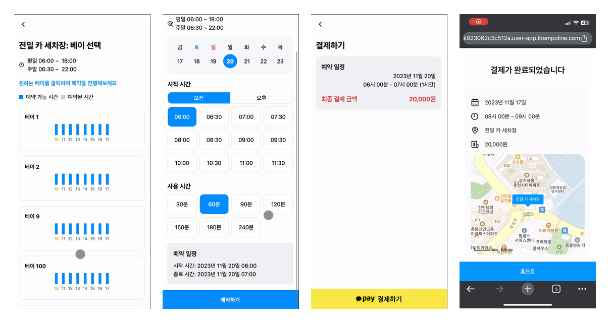
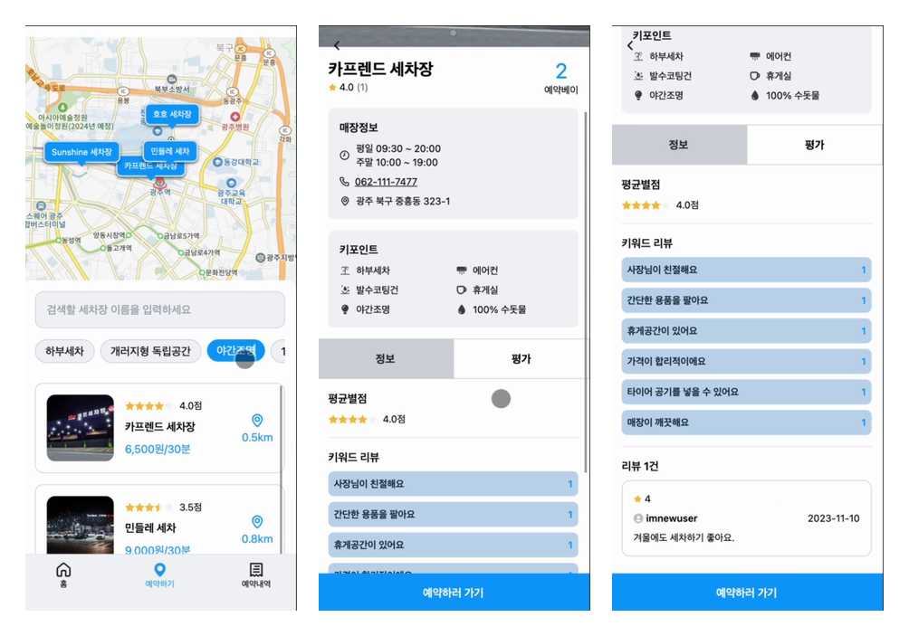
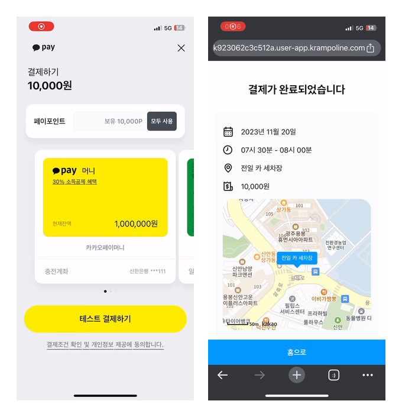
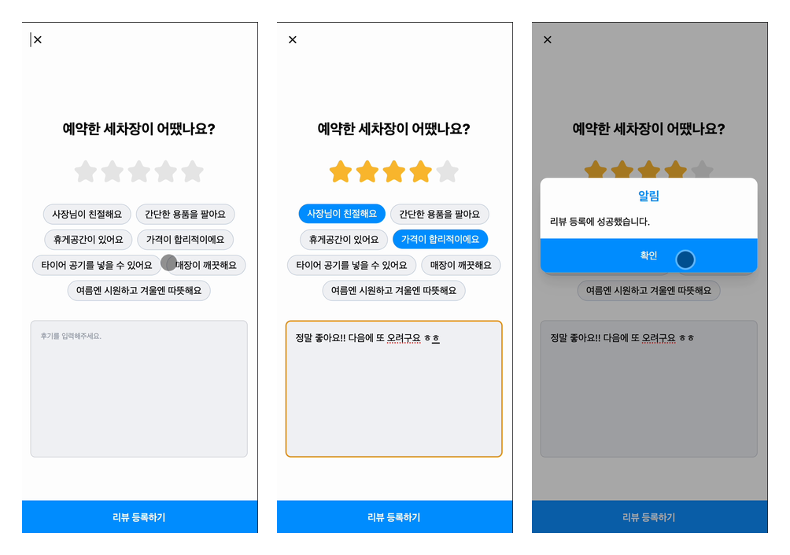
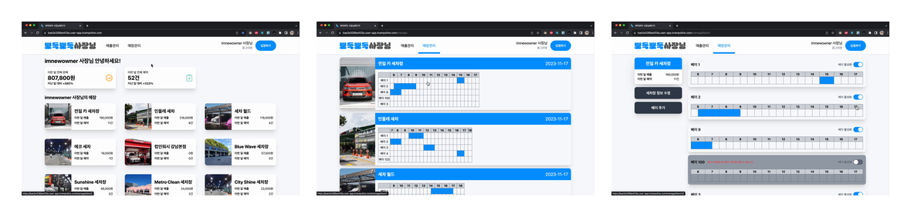
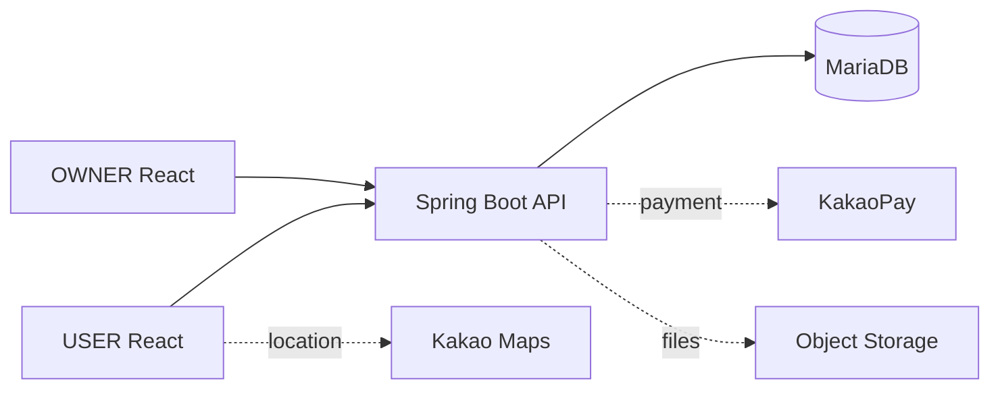
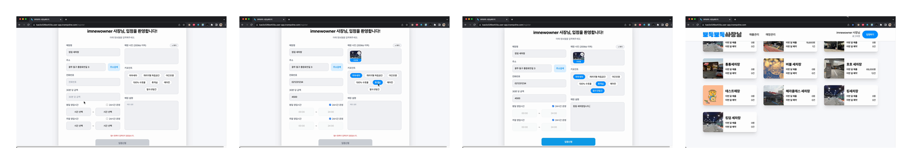

# 뽀득뽀득

> 위치 기반 셀프세차장 탐색부터 Bay 예약, 결제, 리뷰까지 연결한 모바일 웹 기반 셀프세차장 예약 서비스

뽀득뽀득은 6명이 함께 개발한 팀 프로젝트입니다. React 기반 USER Frontend에서 세차장 탐색 → 예약 → 결제 → 예약 관리 → 리뷰로 이어지는 사용자 흐름을 제공합니다. 저는 Bay와 이용 시간을 선택하는 예약 흐름을 중심으로 구현에 참여했으며, 이후 포트폴리오 정리 과정에서 예약·결제 안정성, regression test, Stateful MSW Demo 환경을 보강했습니다.


<p align="center">
  
</p>
<p align="center"><sub>Bay 선택 · 예약 시간 선택 · 결제 · 예약 완료</sub></p>

## Project Overview

| 항목 | 내용 |
|---|---|
| 프로젝트 | 뽀득뽀득 |
| 형태 | Kakao Tech Campus, 6인 팀 프로젝트 |
| 기간 | 2023.09.25–2023.11.11 |
| 서비스 | 셀프세차장 탐색·예약·결제·리뷰 서비스 |
| Frontend | React 기반 USER / OWNER 모바일 웹 |
| Backend | Spring Boot, MariaDB |
| 주요 역할 | USER Frontend의 Bay·예약 선택 흐름과 일부 서비스 UI |
| Portfolio | USER Frontend 안정성·테스트 개선 및 Stateful Demo 구축 |

서비스는 고객용 **USER**와 사업자용 **OWNER**로 구성됩니다. USER는 주변 세차장과 리뷰를 살펴보고 Bay·날짜·시간·이용 시간을 선택해 결제한 뒤 예약을 취소하거나 리뷰를 작성할 수 있습니다. OWNER는 별도 Frontend에서 세차장, Bay, 예약 현황과 매출을 관리합니다.

## Key Features

### 1. 주변 세차장 탐색

현재 위치와 검색 조건을 바탕으로 세차장 목록을 탐색합니다. 상세 화면에서 위치, 운영 정보, 편의 시설과 다른 사용자의 리뷰를 확인한 뒤 예약으로 이동합니다.

<p align="center">
  
</p>
<p align="center"><sub>주변 세차장 탐색 · 상세 정보 · 리뷰 조회</sub></p>

### 2. 예약

세차장을 선택한 뒤 Bay별 예약 가능 시간을 확인합니다. 날짜, 30분 단위 시작 시간과 이용 시간을 순서대로 선택하며, 영업시간과 기존 예약을 반영해 선택 가능한 조합만 제공합니다.

Bay 선택부터 이용 시간 결정까지의 전체 예약 흐름은 상단 Hero visual에서 확인할 수 있습니다.

### 3. 결제 및 예약 관리

선택한 예약 정보와 계산된 금액을 확인한 뒤 결제를 진행합니다. 완료된 예약은 예약 내역에 반영되며, 사용자는 현재·예정·완료 예약을 확인하고 가능한 예약을 취소할 수 있습니다.

<p align="center">
  
</p>
<p align="center"><sub>결제 진행 · 예약 완료</sub></p>

### 4. 리뷰

이용이 완료된 예약에서 별점과 키워드, 내용을 입력해 리뷰를 등록합니다. 작성 결과는 해당 세차장의 리뷰 조회 흐름에 연결됩니다.

<p align="center">
  
</p>
<p align="center"><sub>리뷰 작성 · 키워드 선택 · 등록 완료</sub></p>

### OWNER Management

사업자는 별도 OWNER Frontend에서 세차장 등록과 Bay·예약 현황, 매출을 관리할 수 있습니다. 이는 팀 프로젝트 전체 서비스의 관리 영역이며, 제 초기 UI 기여 범위는 [My Contribution](#my-contribution)에서 별도로 구분합니다.

<p align="center">
  
</p>
<p align="center"><sub>OWNER Dashboard · 매장 일정 · Bay 관리</sub></p>

## Architecture



Portfolio Demo는 동일한 API service와 Axios 경계를 유지한 채 Spring Boot 대신 Stateful MSW를 사용합니다. 기존 Backend fork를 이용한 local integration과 인증·결제 경계는 [Architecture Notes](docs/architecture.md)와 [Local Full-stack Reproduction](docs/local-reproduction.md)에 정리했습니다.

## Tech Stack

| Category | Stack |
|---|---|
| Frontend | React 18, JavaScript, Vite, React Router |
| State | Redux Toolkit, Redux Persist, TanStack React Query |
| UI / Styling | Tailwind CSS, React Spring, React Hook Form |
| HTTP / Data | Axios, Day.js |
| Map | Kakao Maps JavaScript SDK |
| Test / Demo | Vitest, React Testing Library, MSW |
| Build | Vite PWA Plugin, route-level lazy loading |
| Backend / Data | Spring Boot, MariaDB |
| External | KakaoPay, Object Storage |

## My Contribution

### USER Frontend — Main Contribution

- Bay 선택부터 날짜·시작 시간·이용 시간 결정까지 이어지는 예약 UI 흐름을 구현하고, 화면 사이에서 공유되는 예약 state와 lifecycle을 관리했습니다.
- `DurationPicker`, `TimeSlot`, `Schedule`과 Bay 흐름을 다루며 영업시간과 예약 현황이 사용자 선택에 반영되도록 작업했습니다.
- 세차장 상세·리뷰와 Kakao Map UI 일부, 결제 UI와 예약 state를 연결하는 일부 흐름에 참여했습니다.
- 포트폴리오 정리 과정에서 예약 시간 계산과 결제 callback을 안정화하고 loading/error/empty state, cache invalidation, keyboard interaction을 보완했습니다.

USER Frontend 전체나 결제 시스템 전체를 단독 구현한 작업은 아닙니다.

### OWNER Frontend — Supporting Contribution

OWNER Frontend에서는 세차장 등록 화면의 초기 구조와 일부 입력 UI를 구현했습니다. 30분 단위 운영시간과 24시간 영업 옵션, 이미지 선택·미리보기·삭제, Badge 기반 키포인트 선택, 일부 atom UI의 **초기 구현**에 참여했습니다. Dashboard, Sales, Bay·예약 관리, 현재 등록 API와 Backend upload는 개인 기여로 포함하지 않습니다.

<p align="center">
  
</p>
<p align="center"><sub>초기 세차장 등록 · 운영시간 · 이미지 · 키포인트 입력 UI</sub></p>

### Backend — Portfolio Maintenance

2023년 Backend 원 개발 담당자는 아닙니다. 포트폴리오 정리 과정에서 기존 Spring Boot Backend fork를 Java 17·MariaDB local 환경에서 다시 실행할 수 있도록 복구하고 USER Frontend와의 integration을 검증했습니다. Local profile과 seed, JWT/CORS 연결, local-only 결제 흐름을 정리하고 cross-day 예약 datetime 경계 오류를 보완해 관련 regression test를 추가했습니다.

## Engineering Challenges

### 1. Reservation Time Reliability

| 단계 | 내용 |
|---|---|
| Problem | 30분 단위 예약에서 영업 시작·종료, 현재 시각, duration, 기존 예약이 함께 작용해 잘못된 slot이나 이전 선택이 남을 수 있었습니다. |
| Cause | 시간 계산이 picker 표시와 Redux state 변경에 섞여 있어 overlap, 인접 예약, 날짜 변경과 cross-day 경계를 일관되게 검증하기 어려웠습니다. |
| Improvement | 시간 규칙을 pure function으로 분리하고 날짜 변경 시 시작 시간, 시작 시간 변경 시 duration을 reset했습니다. Frontend에서 실제 datetime을 구성하고 Backend의 중복 `+1 day` 보정을 제거해 자정 경계를 한 번만 처리했습니다. |
| Verification | 영업시간, 30분 slot, duration, overlap·인접 예약과 cross-day를 포함한 **24개 reservation regression test**로 검증했습니다. |

세부 규칙과 matrix는 [Refactoring Notes](docs/refactoring.md#reservation-business-rules)에서 확인할 수 있습니다.

### 2. Payment Lifecycle

| 단계 | 내용 |
|---|---|
| Problem | 오래된 `tid`, callback 직접 접근·새로고침, 실패 후 retry가 중복 approve나 잘못된 완료 상태로 이어질 수 있었습니다. |
| Cause | 외부 결제 페이지 이동 전후의 state, approve mutation, 완료 후 예약 state 초기화 책임이 분산돼 있었습니다. |
| Improvement | callback token과 state를 검증하고 잘못된 접근에서는 stale `tid`를 제거했습니다. 진행 중 중복 요청을 차단하고 실패 후 retry를 분리했으며, 완료가 확인된 뒤 예약 state와 query cache를 동기화했습니다. |
| Verification | callback 누락, direct access, duplicate approve 방지, 결과 fallback, Redux reset과 cache invalidation을 regression test로 확인했습니다. |

이는 기존 결제 연동을 사용하는 Frontend lifecycle 안정화 작업이며 KakaoPay Backend 구현을 의미하지 않습니다.

### 3. Stateful Portfolio Demo

종료된 Backend와 실제 KakaoPay에 의존하면 검토자가 핵심 흐름을 안정적으로 체험하기 어렵습니다. 이를 해결하기 위해 다음 경계를 구성했습니다.

```text
React → Existing API Services → Axios → MSW → Stateful In-memory Data
```

- UI에 Demo용 fake 분기를 삽입하지 않고 기존 API service를 그대로 사용합니다.
- 로그인, 가격 계산, fake payment, 예약 생성·취소와 리뷰 등록 결과가 이후 조회에 반영됩니다.
- 등록되지 않은 application `/api/*`는 fail-closed 처리하고 Kakao SDK·map tile·외부 CDN 요청은 통과시킵니다.
- Live build에서는 Demo data, handler, MSW runtime과 worker asset을 제외합니다. Demo build에서는 Stateful MSW만 포함하고 PWA를 비활성화합니다.

### Performance & Runtime Stability

Route-level lazy loading과 공통 `Suspense` fallback을 적용하고 loading/error/empty state, null·undefined 방어, query key와 cache invalidation, mutation 중복 방지, Kakao Maps SDK shared loader를 보완했습니다.

| Metric | Before | After | Reduction |
|---|---:|---:|---:|
| Main JavaScript | 528.08 kB | 302.68 kB | **42.68%** |
| gzip | 177.45 kB | 98.78 kB | **44.33%** |

## Testing & Performance

| 검증 | 결과 |
|---|---:|
| Frontend tests | **73 / 73 passed** |
| Test files | **18 / 18 passed** |
| Reservation rule regression | **24 / 24 passed** |
| Live production source build | Passed |
| Demo production build | Passed |

Backend local integration regression 19개는 Frontend 수치와 분리해 검증했습니다. 전체 테스트 범위와 구현 근거는 [Refactoring Notes](docs/refactoring.md)를 참고하세요.

### Live / Demo Boundary

| | Live | Portfolio Demo |
|---|---|---|
| Backend | Spring Boot | Stateful MSW |
| PWA | Enabled | Disabled |
| MSW runtime / worker | Excluded | Enabled |
| Purpose | 실제 서비스 구조 | 포트폴리오 핵심 흐름 체험 |

## Portfolio Demo

Backend나 실제 결제 서비스 없이도 로그인 → 탐색 → 예약 → 결제 → 예약 취소 → 리뷰 등록 흐름을 확인할 수 있는 Stateful MSW 기반 Demo를 제공합니다. Demo state는 브라우저를 새로고침하면 초기 seed로 돌아갑니다.

**Demo URL:** 배포 후 추가 예정

<!-- TODO: Add Vercel Portfolio Demo URL -->

```bash
npm ci
npm run dev -- --mode demo
```

Production Demo build는 `npm run build:demo`로 생성할 수 있습니다.

## Repositories

| Repository | 역할 | 개인 기여 경계 |
|---|---|---|
| **[Team10_FE_USER](https://github.com/minjuko/Team10_FE_USER)** | **Main USER Frontend** | 예약 흐름 중심 구현 및 포트폴리오 안정화 |
| [Team10_FE_OWNER](https://github.com/minjuko/Team10_FE_OWNER) | Supporting OWNER Frontend | 등록 화면과 일부 입력 UI 초기 구현 |
| [Team10_BE](https://github.com/minjuko/Team10_BE) | Spring Boot Backend | 원 개발 담당 아님; local reproduction·integration 보완 |

USER 저장소 URL은 현재 `origin` remote에서 확인했습니다. OWNER와 Backend는 기존 프로젝트 문서에 연결된 fork 저장소입니다.

## Known Limitations

- Demo state는 영구 저장하지 않으며 브라우저 새로고침 시 초기화됩니다.
- Demo payment는 실제 KakaoPay 결제가 아닌 lifecycle 재현용 local flow입니다.
- Production 환경의 동시 예약 race condition은 별도의 서버 측 동시성 제어가 필요합니다.
- OWNER의 일부 mutation과 외부 Object Storage 연동은 Portfolio Demo 범위 밖입니다.
- 실제 Kakao Map과 외부 서비스 동작은 각 서비스의 환경 설정과 사용 가능 상태에 영향을 받습니다.

## Team & Credits

Kakao Tech Campus 1기 3단계에서 **Frontend 3명, Backend 3명**이 2023.09.25부터 2023.11.11까지 함께 개발했습니다.

| Frontend | Backend |
|---|---|
| [노주영](https://github.com/juyeongnoh) · [김좌훈](https://github.com/catnofat) · [고민주](https://github.com/minjuko) | [김명지](https://github.com/Starlight258) · [김철호](https://github.com/Cheoroo) · [이유진](https://github.com/2Using) |

팀 전체 서비스 기능과 이 README의 개인 기여 범위는 구분해 작성했습니다. 2023년 프로젝트 종료 당시 README는 [README-2023-original.md](docs/archive/README-2023-original.md)에 보존되어 있습니다.
