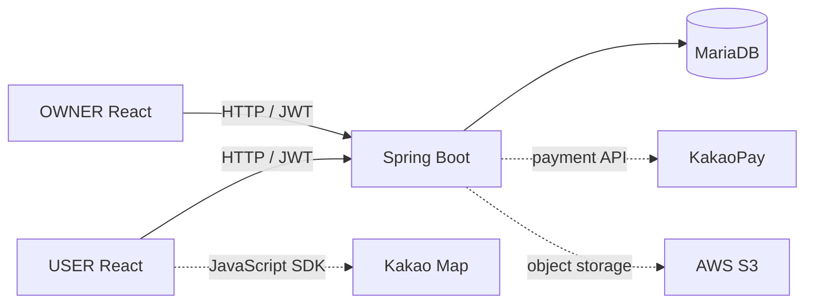
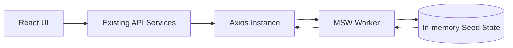
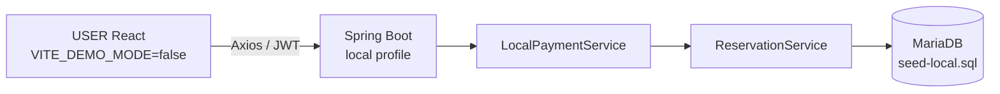

# Architecture Notes

## Timeline and Repository Responsibilities

| 시기/저장소 | 책임 |
|---|---|
| 2023 USER Frontend | React 기반 고객 검색·예약·결제·예약 관리·리뷰 |
| 2023 OWNER Frontend | 사업자 등록·세차장 관리; 본인은 일부 초기 UI에 참여 |
| 2023 Backend | 팀 Backend; 본인 구현이 아님 |
| 2026 USER | 안정성, regression tests, lazy loading, Stateful Demo |
| 2026 Backend fork | local reproduction과 USER integration을 위한 최소 복구·수정 |

## Original / Live

JWT는 로그인 응답의 Authorization header를 통해 Frontend에 전달되고 Axios interceptor가 이후 요청에 포함합니다. KakaoPay와 S3는 original/live 외부 연동이며 2026 local 검증 범위와 분리합니다.

## Portfolio Demo

`VITE_DEMO_MODE=true`일 때만 dynamic import로 worker를 시작합니다. API service와 Axios instance는 Live와 같습니다. handler는 login, carwash/Bay/time/price, fake payment, reservation, cancel, review state를 연결합니다. 등록되지 않은 `/api/*`는 501로 응답해 실수로 실제 Backend에 전달되는 것을 막습니다. 브라우저 refresh는 모듈 state를 다시 만들기 때문에 seed로 초기화됩니다.

## Local Reproduction

Spring `local` profile에서 `LocalPaymentService`가 활성화되고 실제 KakaoPay를 호출하는 service는 제외됩니다. ready가 local callback URL을 반환하고 approve가 기존 `ReservationService`를 거쳐 MariaDB에 예약을 생성합니다. 이 구조는 신규 Backend 개발이 아니라 original team Backend fork를 로컬에서 재현하기 위한 integration support입니다.

## Payment Flow Boundaries

| 환경 | ready / callback / approve | 저장 결과 |
|---|---|---|
| Portfolio Demo | MSW fake lifecycle | in-memory reservation |
| Local Full-stack | Spring local `LocalPaymentService` | MariaDB reservation |
| Production / Live | KakaoPay service | 2026 E2E 미검증 |
